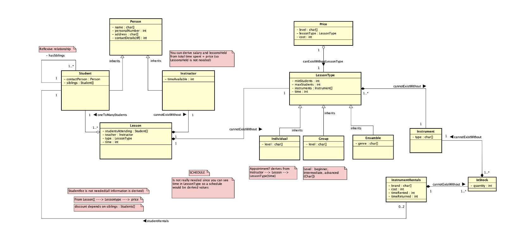

# PostgreSQL Project

This repository contains a project implemented in PostgreSQL as part of the Data Storage Paradigms - IV1351 course. The project demonstrates SQL-based database design and implementation with a focus on data storage efficiency, querying, and integrity.

## Overview

The purpose of this project is to explore database design principles and implement a functional PostgreSQL database system. The project includes:
- A conceptual model for effective data representation.
- SQL scripts for creating, populating, and querying the database.
- Examples of data manipulation and retrieval using advanced SQL techniques.

---

## Features

- **Entity-Relationship Modeling**: A structured approach to designing the database schema.
- **Data Integrity**: Implementation of constraints and triggers for maintaining data consistency.
- **Custom Queries**: Pre-configured SQL queries for common use cases.
- **Scalability**: Designed for efficient querying and data manipulation.

---

